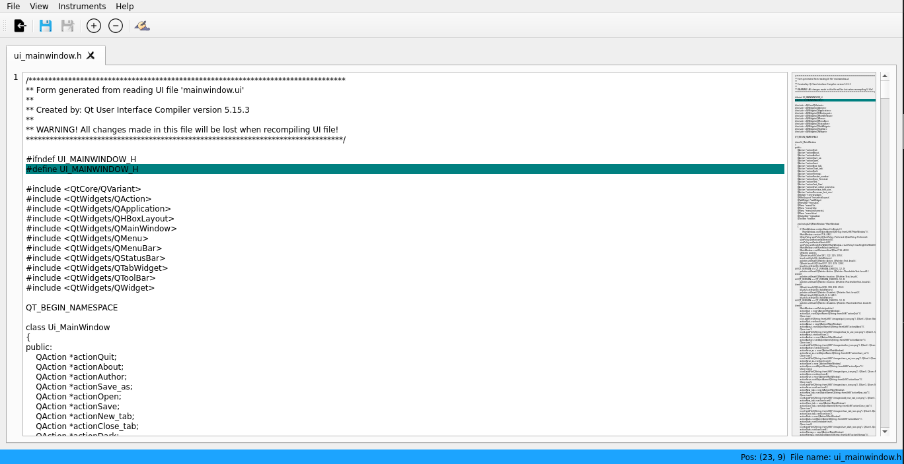
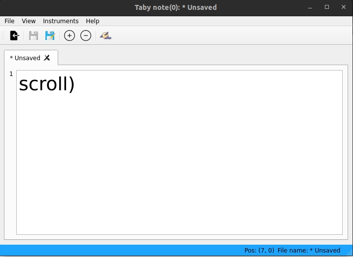
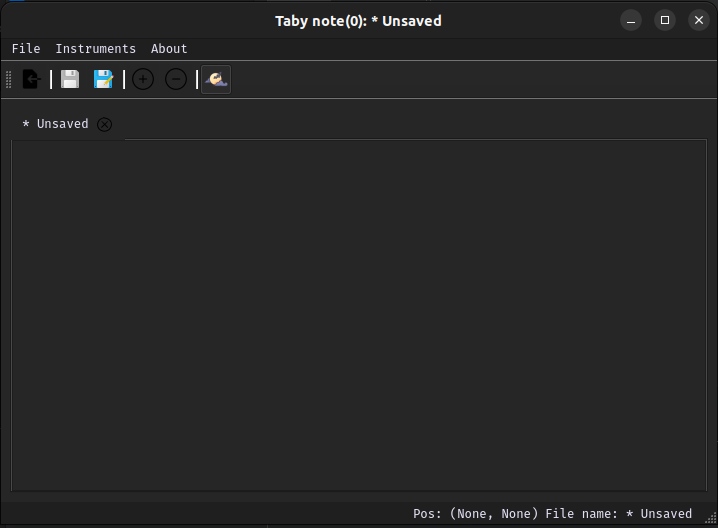
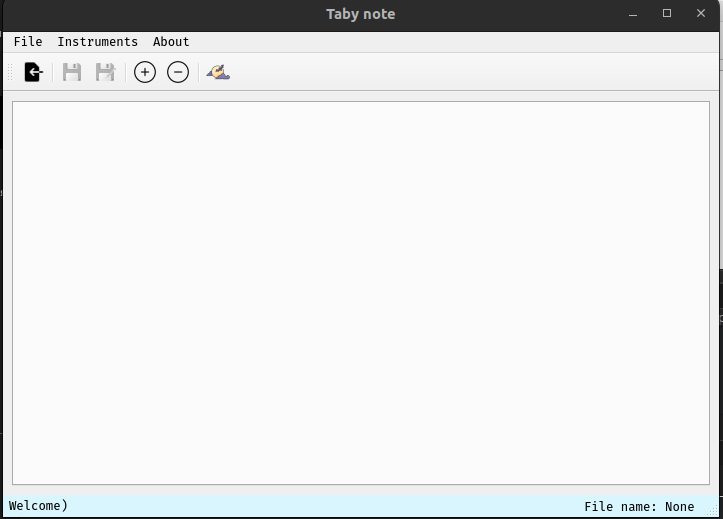
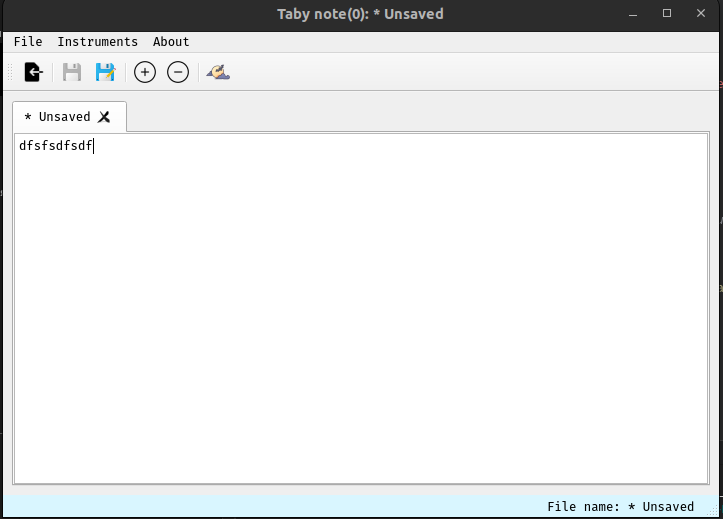
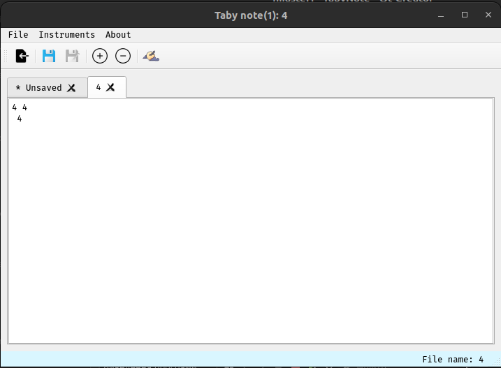
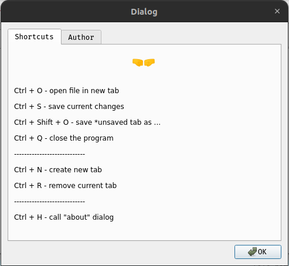
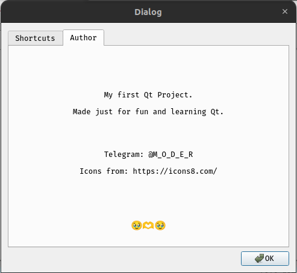

# TabyNote

## New 
* added some new buttons
* some fix

## Next edits
* fix file overview zone (add box to show current visible zone in editor workspace)
* fix some bugs with dark theme
* add numbar to editor
* 'find', 'replace' tool
* terminal

## Window examples

